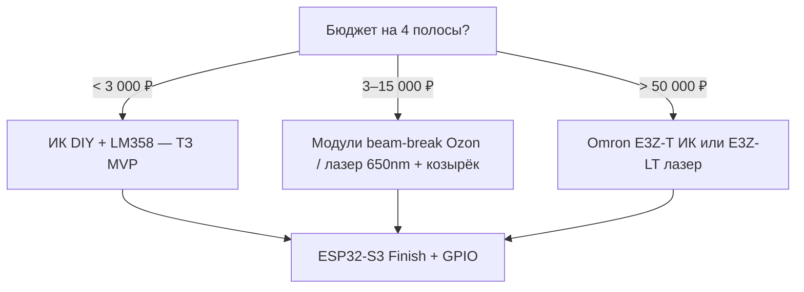

# Компоненты в Москве: закупка, датчики линии, камера 120 fps

Справочник по **доступным в Москве** (и с быстрой доставкой в МСК) позициям для MVP **без RFID**: где купить, чем заменить ИК на линии, какие камеры дают нужный **frame rate** для фото-финиша.

**Связанные документы:** [cost-mvp-no-rfid.md](cost-mvp-no-rfid.md) · [TZ.md §8](TZ.md#8-спецификация-железа) · [camera.md](camera.md) · [start-unit.md](start-unit.md)

**Версия:** 0.1  
**Дата:** 2026-05-28  
**Статус:** черновик (цены проверять на сайте перед заказом)

---

## 1. Поставщики (Москва и доставка в МСК)

| Магазин | Сайт | Что брать для проекта | Самовывоз / доставка |
|---------|------|------------------------|----------------------|
| **Амперка** | [amperka.ru](https://amperka.ru/) | Pi Camera 3, иногда Pi 5, модули, зуммеры, MAX7219 | Склад Москва (Павелецкая наб.) |
| **Чип и Дип** | [chipdip.ru](https://www.chipdip.ru/) | ESP32, USB-UART, LM358, ИК LED, SD, кнопки | Пункты выдачи по Москве |
| **ONPAD** | [onpad.ru](https://onpad.ru/) | Pi Camera 3, кабели CSI, аксессуары Pi | Москва, каталог RPi |
| **КОМПЭЛ** | [compel.ru](https://www.compel.ru/) | Raspberry Pi, промышленные разъёмы | Москва |
| **Mobismart** | [mobismart.ru](https://mobismart.ru/) | Pi Camera 3 (КП), промышленные боксы | Москва, Озёрная |
| **Robotos** | [robotos.ru](https://robotos.ru/) | ESP32 DevKit, датчики, макетка | Москва |
| **Амперка / DIY** | Маркетплейсы | Powerbank, штативы, LED-ленты | Ozon, WB, Я.Маркет |
| **Промэлектрика, iAutomatica, ТТК** | [promelectrica.ru](https://promelectrica.ru/), [iautomatica.ru](https://iautomatica.ru/), [ttk-rus.ru](https://www.ttk-rus.ru/) | **Omron E3Z** — фотоэлектрика на пересечение | Доставка по МСК |
| **RFID-Scan** | [rfid-scan.ru](https://rfid-scan.ru/) | Только **фаза 2** UHF | Москва |

*AliExpress / Ozon «ESP32-S3» — дешевле, но срок 1–4 нед; для срочного прототипа — Чип и Дип / Амперка.*

---

## 2. Central: Raspberry Pi 5 + фото-финиш

### 2.1. Уже есть

| Позиция | Ваш бюджет | Примечание |
|---------|------------|------------|
| Raspberry Pi 5 **8 GB** | **12 000 ₽** | См. [cost-mvp-no-rfid.md](cost-mvp-no-rfid.md) |

### 2.2. Докупить к Pi 5 (Москва)

| Позиция | Где искать | Ориентир ₽ | Артикул / ссылка |
|---------|------------|------------|------------------|
| **Pi Camera Module 3** 75° | Амперка, ONPAD | 5 740 – 6 190 | [AMP Camera 3](https://amperka.ru/product/raspberry-pi-camera-module-3), [ONPAD RASP7620](https://onpad.ru/catalog/cubie/raspberrypi/cameras/3456.html) |
| Module 3 **Wide** 120° | ONPAD, import | 6 450 – 7 500 | Широкий угол — дальний монтаж |
| Module 3 **NoIR** | Амперка | ~5 740 | Ночной каток + ИК-подсветка |
| **CSI 15→22 pin**, 30–50 cm | ONPAD, Chipdip | 350 – 1 200 | Обязателен для Pi 5 |
| microSD 64 GB **A2** | Chipdip, DNS, Ozon | 700 – 1 400 | Samsung Pro Plus / Kingston Canvas |
| БП **5 V 5 A** USB-C | Амперка, офиц. блок Pi | 1 200 – 2 800 | Не 3 A — просадка fps |
| Активное охлаждение Pi 5 | Амперка, Compel | 800 – 2 500 | Радиатор + вентилятор |
| Корпус IP65 | Mobismart, Ozon | 1 500 – 4 000 | Вводы под витую пару / USB |
| USB-UART CH340 / CP2102 | Chipdip | 300 – 800 × **2** | Отдельно Finish и Start |

---

## 3. Камеры и frame rate (требование PH-02)

ТЗ и [camera.md](camera.md): **≥ 120 fps**, точность кадра **≤ 8 ms**, привязка к IR через **GPIO**.

### 3.1. Сводная таблица

| Камера | Интерфейс | Режим ≥120 fps | Затвор | MVP? | Москва |
|--------|-----------|----------------|--------|------|--------|
| **Pi Camera Module 3** (IMX708) | CSI | **1536×864 @ 120** | Rolling | **Да, основная** | Амперка, ONPAD |
| Pi Camera Module 3 **Wide** | CSI | то же | Rolling | Да, широкий угол | ONPAD |
| Pi Camera Module 2 (IMX219) | CSI | max **90** @ 640×480 | Rolling | **Нет** | Не покупать |
| Pi **HQ** Camera (IMX477) | CSI | **1332×990 @ 120** | Rolling | Апгрейд оптики | ONPAD, import |
| Pi **GS** Camera (IMX296) | CSI | max **60** | Global | **Нет** для 120 fps | — |
| **ArduCam B0385** (OV9782) | USB UVC | **1280×800 @ 120** MJPEG | Global | Апгрейд v2 | Заказ / Ali, редко в рознице |
| **ELP AR0234** USB | USB UVC | **1920×1200 @ 120** | Global | Апгрейд v2 | ELP-опт, Ali |
| ArduCam OV9281 USB | USB | 100 fps | Global | **Нет** (<120) | — |
| Обычная USB 1080p webcam | USB | 30–60 | Rolling | **Нет** | — |

### 3.2. Рекомендация для закупки

**Покупать:** **Raspberry Pi Camera Module 3** (стандарт 75°) + CSI **15→22** + проверка `picamera2` 120 fps на вашей Pi 5.

**Wide** — если с одной точки не помещаются 2–4 сектора линии.

**Global Shutter USB** — только если на катке rolling shutter даёт неприемлемые артефакты; отдельная прошивка V4L2, не `picamera2` ([camera.md §5.2](camera.md#52-global-shutter-usb-апгрейд)).

### 3.3. Минимальный чеклист приёмки камеры

- [ ] `FrameDurationLimits` → стабильно **≥ 118 fps** 5 минут  
- [ ] GPIO от Finish → `frame_idx` ±1 кадр  
- [ ] Ручной фокус, подсветка LED 12 V  
- [ ] Overlay линии = физическая белая линия 5 cm  

---

## 4. Датчики пересечения линии

В ТЗ MVP — **ИК 940 nm** (LED + фототранзистор + LM358 на полосу). Ниже — **варианты с лазером / промышленной оптикой** для сравнения.

### 4.1. Вариант A — ИК DIY (рекомендуется MVP)

| Компонент | Где (Москва) | Ориентир |
|-----------|--------------|----------|
| IR LED 940 nm 5 mm | Chipdip | 15 – 40 ₽ |
| Фототранзистор (аналог BPW) | Chipdip | 20 – 60 ₽ |
| LM358 / TL072 | Chipdip | 30 – 80 ₽ |
| Резисторы, конденсаторы | Chipdip | 100 – 300 ₽/полоса |
| Трубка/козырёк от солнца | DIY | — |

| Плюсы | Минусы |
|-------|--------|
| Дёшево, 4 полосы &lt; 2 000 ₽ | Чувствителен к солнцу и грязи |
| Прямой GPIO + ISR на ESP32 | Нужен козырёк и калибровка |
| Как в прошивке ТЗ | Не «лазер» для участников |

**Схема:** Finish ESP32 → компаратор LM358 → GPIO + UART JSON `FINISH`.

### 4.2. Вариант B — «Лазерные» модули ближнего действия (бюджет)

Плата **пересечения луча** с коллиматором (часто **красный лазер 650 nm**, не ИК) — Ozon / Ali «лазерный датчик NPN», «beam break sensor».

| Параметр | Типично |
|----------|---------|
| Дальность | 0.5 – 3 m (достаточно для ширины дорожки) |
| Выход | NPN/PNP open collector → вход ESP32 **через делитель/оптрон** |
| Цена | 400 – 1 500 ₽ × полоса |
| Москва | Ozon, WB, иногда Chipdip (модули) |

| Плюсы | Минусы |
|-------|--------|
| Узкий луч, проще выставить | **Солнце и блики** — хуже ИК с козырьком |
| Готовый корпус | Нужна **гальваническая развязка** с ESP32 |
| Визуально виден луч | Безопасность: не в глаза, заглушки |

**Интеграция:** выход датчика → GPIO ESP32 (ISR `micros()`), логика та же, что IR.

### 4.3. Вариант C — Промышленная фотоэлектрика Omron **E3Z** (лазер / ИК)

**Through-beam** (излучатель + приёмник на стойках рамы) — стандарт для «пересечения луча».

| Модель | Тип луча | Дальность | Ориентир ₽ (комплект TX+RX) | Москва |
|--------|----------|-----------|-------------------------------|--------|
| **E3Z-T61/T81** | Красный или **ИК** | до 10–15 m | ~8 000 – 15 000 | [Promlectrica](https://promelectrica.ru/catalog/datchiki/fotodatchici/e3z_t61_2m_oms_omron/) |
| **E3Z-T61 ИК** | Инфракрасный | 15 m | ~12 000 | iAutomatica, ТТК |
| **E3Z-LT61/LT81** | **Лазер** | до 60 m (избыток) | ~14 500 – 30 000+ | [iAutomatica E3Z-LT](https://iautomatica.ru/catalog-omron/fotoelektricheskie-datchiki-omron-e3z-b/) |
| **E3Z-LR** | Лазер рефлекторный | 15 m | ~16 000 | Promlectrica |

| Плюсы | Минусы |
|-------|--------|
| Надёжность, LED-индикация, IP67 варианты | **×4 полосы = 50–120k ₽** |
| Готовая оптика | Выход 12–24 V → нужен **оптрон/реле** |
| ИК-версия лучше на улице, чем красный лазер | Overkill для 0.5 m между стойками |

**Для роликов на 2–4 m ширины:** достаточно **E3Z-T61 ИК** на 1–2 m между стойками; лазер **E3Z-LT** — если длинная база или яркое солнце и есть бюджет.

**Интеграция с ESP32:**  
PNP/NPN → оптрон PC817 → GPIO + общий GND; **не** подключать 12 V датчика напрямую к 3.3 V GPIO.

### 4.4. Вариант D — Time-of-Flight / LiDAR

| Пример | Москва | Вердикт |
|--------|--------|---------|
| VL53L0X / VL53L1X | Chipdip, модуль | Узкое поле, скорость ролика — **не для финишной линии** |
| RPLIDAR | Robotos | Overkill, не линия |

**Не рекомендуется** для финиша MVP.

### 4.5. Выбор для проекта

| Цель | Выбор |
|------|--------|
| Совпасть с ТЗ и [cost-mvp-no-rfid.md](cost-mvp-no-rfid.md) | **4.1 ИК DIY** |
| «Лазер» в бытовом смысле, умеренный бюджет | **4.2** модули + оптрон |
| Промышленная эксплуатация, дождь/солнце | **4.3 E3Z-T ИК** (не LT, если расстояние &lt; 3 m) |

---

## 5. ESP32 и стартовый модуль

| Позиция | Где (Москва) | Ориентир ₽ |
|---------|--------------|------------|
| **ESP32-S3-DevKitC-1** N16R8 | Chipdip, Robotos, Ozon | 1 400 – 2 500 |
| **ESP32-WROOM-32** DevKit (Start MVP-UART) | Chipdip, Амперка | 550 – 950 |
| MAX7219 матрица 8×8 | Chipdip, Амперка | 250 – 600 |
| Зуммер 5 V | Chipdip | 50 – 150 |
| Кнопки тактовые | Chipdip | 40 – 100 / шт |

Подробно уровни Start: [start-unit.md §4.1.3](start-unit.md#413-уровни-комплектации).

---

## 6. Механика, питание, кабели

| Позиция | Где | Ориентир ₽ |
|---------|-----|------------|
| Профиль алюминий 20×20 / ПВХ | Leroy Merlin, Ozon | 1 500 – 4 000 |
| Белая лента 50 mm / краска | LM | 200 – 600 |
| Powerbank 20 Ah PD | DNS, Ozon | 2 000 – 4 500 |
| Витая пара 4–6 жил, 5–10 m | Chipdip, электрорынок | 300 – 800 |
| LED-бар 12 V + БП 12 V | Ozon, Амперка | 1 200 – 3 500 |
| Штатив камеры | фото-магазины, Ozon | 1 500 – 4 000 |

---

## 7. Готовые списки закупки (копировать в корзину)

### 7.1. Минимум «завести Pi 5 + 1 полосу финиша»

1. Pi Camera Module 3 + CSI 15→22  
2. microSD 64 A2 + БП 5 V 5 A  
3. USB-UART × 1  
4. ESP32-S3 × 1  
5. ИК-набор × 1 (LED + фото + LM358)  
6. Провод Dupont, макетка  

### 7.2. Полевой MVP (4 полосы, без RFID) — см. [cost-mvp-no-rfid.md §9](cost-mvp-no-rfid.md#9-чеклист-закупки-порядок)

### 7.3. Только RFID (фаза 2, не сейчас)

[rfid-transponders.md §5](rfid-transponders.md#5-рынок-россии-и-москвы) — RFID-Scan, SAUK, Зелбайк.

---

## 8. История версий

| Версия | Изменения |
|--------|-----------|
| 0.1 | Поставщики Москвы; ИК vs лазер vs Omron; камеры 120 fps |
