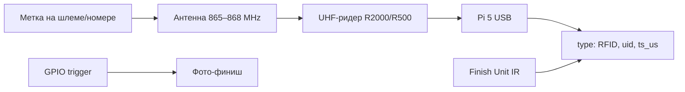

# UHF-транспондеры (RFID) — финиш и идентификация участников

Описание технологии пассивных UHF-транспондеров для расширения системы хронометража скоростных роликов (**фаза 2**, опция к MVP на ИК-датчиках).

**Связанные документы:** [TZ.md](TZ.md) (§4.6, §8.7) · [functional.md](functional.md) · [camera.md](camera.md)

**Версия:** 0.1  
**Дата:** 2026-05-28  
**Статус:** черновик

---

## 1. Назначение в проекте

| Режим | Что фиксирует | Статус |
|-------|---------------|--------|
| **ИК (IR)** по полосам | Момент пересечения линии + номер полосы | MVP, обязательно |
| **UHF RFID (транспондер)** | UID участника (кто пересёк линию) | Фаза 2, опция |
| **Фото-финиш** | Визуальное подтверждение при споре | MVP, на Pi 5 |

Транспондер **не заменяет** ИК и GPIO-триггер: ИК даёт точный момент и полосу; RFID дополняет идентификацией по метке на шлеме / номере. GPIO от Finish Unit по-прежнему нужен для привязки кадра камеры.

Требования из ТЗ: [EX-01 … EX-04](TZ.md#46-расширение-rfid).

---

## 2. Как это работает

### 2.1. Принцип (пассивный UHF)

1. Участник носит **пассивную метку** (транспондер): EPC Gen2, без батареи.
2. В финишной раме — **UHF-антенна** (patch, mat или боковые стойки) и **ридер**.
3. При прохождении через поле антенны ридер считывает **EPC / UID** метки.
4. Ридер по **USB serial** отдаёт событие на **Raspberry Pi 5**.
5. Pi 5 сопоставляет `uid ↔ bib` (поле `rfid_uid` у участника) и пишет событие `RFID` в общий поток.



### 2.2. Событие в протоколе

```json
{
  "type": "RFID",
  "ts_us": 1234567890123,
  "heat_id": "H001",
  "lane": 2,
  "bib": 42,
  "src": "rfid",
  "payload": { "uid": "E280116060000204AC000000" }
}
```

Единый формат с `START`, `FINISH`, `PHOTO` — см. [TZ.md §6](TZ.md#6-протокол-событий).

### 2.3. Конфликты источников

| Ситуация | Действие |
|----------|----------|
| IR и RFID согласны (полоса ↔ bib) | Автоматический результат, `final_source: line` |
| RFID опознал bib, IR — только полосу | Судья или правило heat (масс-старт с разметкой полос) |
| IR и RFID / фото расходятся | Решение судьи, `final_source: photo` или ручная правка |

### 2.4. Частота для России / Европы

| Регион | Диапазон | Стандарт |
|--------|----------|----------|
| РФ, ЕС (ETSI) | **865–868 MHz** | ISO 18000-6C / EPC Gen2 |
| США (FCC) | 902–928 MHz | Тот же протокол, другой диапазон |

Для площадок в РФ выбирать ридер и метки с поддержкой **865–868 MHz** (не только FCC 915 MHz).

### 2.5. Ограничения для коньков на роликах

| Параметр | Комментарий |
|----------|-------------|
| Скорость на финише | До ~50 km/h — в пределах заявлений систем (300 km/h у промышленных решений) |
| Полосы 2–4 | RFID слабо различает полосу; **полосу даёт ИК** |
| Плотный масс-старт | Нужны метки с anti-collision; возможны ложные считывания «до линии» — настройка мощности и геометрии антенны |
| Метка на шлеме | Предпочтительнее номера на груди (меньше наклона корпуса) |

---

## 3. Состав оборудования (по ТЗ §8.7)

| Позиция | Назначение | Ориентир в проекте |
|---------|------------|-------------------|
| UHF-ридер | Считывание, USB → Pi 5 | Impinj **R2000** (старт) или **R500** (компактный прототип) |
| Антенна | Зона у финишной линии | Patch 868 MHz или mat 4–5 m (марафонский тип) |
| Метки (транспондеры) | UID на участнике | На шлем, номер (bib), браслет |
| Powered USB-hub | Питание ридера | Уже в BOM Central |

**Бюджет (из ТЗ):** reader + антенна + ~50 меток ≈ **18 000 – 35 000 ₽** (импорт / Ali); готовые российские комплекты — от **~80 000 ₽** только ридер, см. §5.

---

## 4. Типы транспондеров (меток)

| Тип | Крепление | Одноразовая | Типичный чип |
|-----|-----------|-------------|--------------|
| **Bib tag** (foam / Dogbone) | Номер на груди, булавка | да / многоразовая | Impinj Monza, NXP UCODE 8 |
| **Wristband** | Запястье / лодыжка | многоразовая | Impinj, IP65–68 |
| **Shoe tag** | Обувь | часто одноразовая | Foam inlay |
| **Label на шлем** | Самоклейка / лента | многоразовая | Малый inlay 40×36 mm |

**Протокол:** ISO/IEC 18000-6C, EPC Class 1 Gen 2 — обязательно для совместимости с «открытыми» ридерами.

### 4.1. Не путать с другими системами

| Система | Тип | Совместимость с нашим ТЗ |
|---------|-----|---------------------------|
| **MYLAPS ProChip** | Активный RFID, закрытая экосистема | Нет |
| **ChampionChip** (NL) | Исторически HF, своя инфраструктура | Нет |
| **Пассивный UHF Gen2** | 865–868 MHz, любой EPC-ридер | **Да** (целевой вариант) |

---

## 5. Рынок России и Москвы

> Цены и наличие уточнять у поставщика. Дата среза: **2026-05**. Ссылки — для ориентира, не реклама.

### 5.1. Специализированный спортивный хронометраж

| Поставщик | Регион / доставка | Продукт | Примечание |
|-----------|-------------------|---------|------------|
| [ХроноСпорт](https://cronosport.ru/) | РФ, представитель Timingsense | **TS2**, **TSportable**, антенны, чипы | UHF, цена по запросу; аренда и покупка. Тел. +7 929 584-39-58, info@cronosport.ru |
| [ОСТИ](https://www.osti-timing.ru/products/index.php?SECTION_ID=147) | СПб (+ доставка по РФ) | **TIMING-200** | Транспондерная RFID-система, точность 0,01 с, до 300 km/h; комплекс с фотофинишем |
| [Зелбайк Хроно](http://chrono.zelbike.ru/chrono-buy-equipment) | Москва (ориентир на сайте) | Модули отсечки, пассивные RFID-метки | Спринт/вело до ~35 km/h; одноразовые и многоразовые чипы; комплект от ~45 ₽/участник (модель подписки) |
| [SAUK](https://sauk.ru/rfid-sport) | **Москва**, Зеленоград (технопарк «ЭЛМА») | Навесные и напольные антенны, комплекты | Производство в РФ; марафон, трейл, вело; аренда и подбор комплекта |

### 5.2. RFID-оборудование общего назначения (Москва, подходит для DIY)

| Поставщик | Адрес / канал | Пример | Цена (ориентир) |
|-----------|---------------|--------|-----------------|
| [RFID-Scan](https://rfid-scan.ru/) | Москва, доставка по РФ | [Hopeland 2-port, R2000/E710, 865–868 MHz](https://rfid-scan.ru/catalog/rfid_schityvateli_metok/statsionarnye_rfid_schityvateli/22568/) | **≈ 82 800 ₽** |
| [RFID-Scan](https://rfid-scan.ru/) | Москва | [Alien ALR-F800, 4 порта](https://rfid-scan.ru/catalog/rfid_schityvateli_metok/statsionarnye_rfid_schityvateli/18489/) | **≈ 133 662 ₽** |
| [Jiar RFID (RU)](https://jiarfidtag.com/ru/) | Доставка в РФ | UHF-ридеры, спортивные браслеты, метки | Опт, цена по запросу |

Эти ридеры **не являются** готовым «sport timing kit», но при Gen2-метках и антенне у линии интегрируются с Pi 5 через USB/RS232 и SDK.

### 5.3. Импорт (доставка в РФ)

| Канал | Что заказывают | Ориентир цены |
|-------|----------------|---------------|
| AliExpress / Alibaba | Комплект R2000 + mat-антенна + foam-теги | Ридер $50–350; теги от $0.1–0.5/шт оптом |
| Производители меток | Dogbone marathon tag (M830, Monza) | Экспорт, таможня и сроки на усмотрение покупателя |

Подходит для DIY по [TZ.md §8.7](TZ.md#87-опция-rfid-фаза-2); для разового чемпионата часто проще **аренда** у ХроноСпорт / SAUK.

### 5.4. Чего обычно нет в рознице

| Канал | Вывод |
|-------|--------|
| Ozon / Wildberries | Готовых комплектов «sport timing UHF» по сути **нет**; встречаются отдельные UHF-метки и ридеры складского учёта — проверять **865–868 MHz** и Gen2 |
| Магазины электроники | Ридеры есть, спортивные mat-антенны и foam-теги — редко |

### 5.5. Рекомендуемый путь для проекта speed-skating-timing

| Этап | Действие |
|------|----------|
| 1 | MVP: ИК + фото-финиш без RFID |
| 2 | Прототип: один ридер (R500 USB или Hopeland) + 10–20 Gen2-меток + patch-антенна в раме |
| 3 | ПО на Pi 5: драйвер USB → `RFID` event → `uid ↔ bib` |
| 4 | Поле: калибровка зоны считывания (без срабатывания за 2–3 m до линии) |
| 5 | Производство: закупка меток оптом (импорт) или аренда комплекта на крупный старт |

---

## 6. Интеграция с Raspberry Pi 5

| Параметр | Значение |
|----------|----------|
| Подключение | USB serial (CDC / виртуальный COM) |
| Протокол на шине | Зависит от ридера (LLRP, proprietary ASCII, SDK) — абстракция в `timing-rfid` service |
| Синхронизация времени | `ts_us` от Pi 5 (NTP master); задержка ридера калибруется |
| Питание | Powered USB-hub из BOM §8.1 |
| Соседство с Finish UART | Отдельный USB-порт; общий GND при необходимости |

Планируемый стек (ТЗ §9): Python, событие в SQLite, WebSocket `/ws/live` вместе с `FINISH`.

---

## 7. Монтаж в финишной раме

Задел в ТЗ: [финишная рама с местом под patch-антенну 868 MHz](TZ.md#83-finish-unit).

| Вариант антенны | Плюсы | Минусы для роликов |
|-----------------|-------|---------------------|
| **Patch** в раме у линии | Компактно, 2–4 m ширина | Узкая зона, нужна точная настройка |
| **Mat** под линией (4–5 m) | Массовый финиш, высокая считываемость | Толщина, не закапывать в снег; для роликов — проверить износ |
| **Боковые** на треногах | Неровное покрытие | Занимают место у борта дорожки |

Для **2–4 полос** на роликах разумно начать с **patch или короткой mat** + ИК по полосам.

---

## 8. Чеклист закупки (РФ)

- [ ] Ридер: ETSI **865–868 MHz**, ISO 18000-6C
- [ ] Интерфейс: USB (для Pi 5) или RS232 + USB-адаптер
- [ ] Антенна: линейная / mat, совместима с ридером (SMA, импеданс 50 Ω)
- [ ] Метки: EPC Gen2, крепление под шлем или bib
- [ ] Тест: считывание на скорости ≥ 30 km/h, 2–4 метки в зоне
- [ ] ПО: экспорт UID + timestamp или интеграция SDK в Python
- [ ] Сертификация / Частоты: при коммерческих стартах уточнить требования к радиооборудованию в РФ

---

## 9. Самодельные и open-source проекты

> **Важно:** «Самодельный транспондер» на практике почти всегда означает **самодельную систему считывания** + **покупные пассивные метки** (EPC Gen2). Сам чип/antenna inlay дома не изготавливают — покупают foam-bib, Dogbone, NTAG и т.п.

**Подробные описания (принцип работы, состав, ограничения):** субмодуль **[rfid-diy/](rfid-diy/README.md)** ([gitflic.ru/project/andybeg/rfid-diy](https://gitflic.ru/project/andybeg/rfid-diy)) — отдельный файл на каждый проект.

### 9.1. UHF (860–960 MHz) — ближе к нашему ТЗ

| Проект | Документ |
|--------|----------|
| Trail_RFID | [rfid-diy/trail-rfid.md](rfid-diy/trail-rfid.md) |
| RFID Race timer (Hackster) | [rfid-diy/rfid-race-timer.md](rfid-diy/rfid-race-timer.md) |
| ZRound_SRTR | [rfid-diy/zround-srtr.md](rfid-diy/zround-srtr.md) |
| SparkFun SRTR | [rfid-diy/sparkfun-srtr.md](rfid-diy/sparkfun-srtr.md) |
| PikaReader | [rfid-diy/pika-reader.md](rfid-diy/pika-reader.md) |
| PikaTimer | [rfid-diy/pika-timer.md](rfid-diy/pika-timer.md) |
| Racetiming (nfogh) | [rfid-diy/racetiming.md](rfid-diy/racetiming.md) |
| Chicha | [rfid-diy/chicha.md](rfid-diy/chicha.md) |
| RfidDotNet | [rfid-diy/rfid-dotnet.md](rfid-diy/rfid-dotnet.md) |

**Железо-референс для DIY:** SparkFun M6E Nano / **M7E Hecto** (USB-C, open hardware) — удобная база вместо «голого» R2000-модуля; метки — любые Gen2 (ETSI 865–868 MHz для РФ).

### 9.2. HF 13,56 MHz (NFC) — другая технология

Не совместима с UHF из [TZ.md §8.7](TZ.md#87-опция-rfid-фаза-2), но популярна у энтузиастов:

| Проект | Документ |
|--------|----------|
| Sportiduino | [rfid-diy/sportiduino.md](rfid-diy/sportiduino.md) |
| OpenRaceTiming | [rfid-diy/open-race-timing.md](rfid-diy/open-race-timing.md) |

Для **скоростных роликов на финише 30–50 km/h** HF с телефона в руке не подходит; UHF с mat/patch — да.

### 9.3. Что взять для speed-skating-timing

| Из DIY-экосистемы | К нашей архитектуре |
|-------------------|---------------------|
| Trail_RFID, PikaReader | Паттерн: Pi 5 + USB-ридер + Python + событие `RFID` |
| SparkFun / RfidDotNet | Быстрый прототип ридера до промышленного R2000 |
| Sportiduino | Только идея «дешёвых станций»; частота и протокол другие |
| Покупные foam-теги | «Транспондер» = метка, не самоделка |

Полностью **открытого клона** Timingsense / Race Result «под ключ» нет — обычно собирают: **открытый ридер + открытое или своё ПО + коммерческие Gen2-метки**.

---

## 10. Ссылки

### Документация проекта

- [TZ.md §4.6](TZ.md#46-расширение-rfid) — требования EX-01 … EX-04
- [TZ.md §8.7](TZ.md#87-опция-rfid-фаза-2) — BOM RFID
- [TZ.md §10](TZ.md#10-смета-ориентир-) — смета фазы 2

### Примеры меток (международные производители)

- [ETS Reusable Sports Tag](https://www.etsrfid.com/product/rfid-reusable-sports-timing-tag/)
- [Jiar Sports Timing Wristband](https://jiarfidtag.com/sports-timing-chip-reusable-uhf-rfid-wristband-tag/)
- [ONETIME UHF Decoder (unlocked)](https://uk.onetime.sport/uhf-decoder)

---

## 11. История версий

| Версия | Изменения |
|--------|-----------|
| 0.1 | Первый документ: принцип, типы меток, интеграция с Pi 5, обзор рынка РФ/Москвы |
| 0.2 | §9 — самодельные и open-source проекты (UHF / HF) |
| 0.3 | Каталог [rfid-diy/](rfid-diy/README.md) — отдельный файл на каждый DIY-проект |
| 0.4 | DIY вынесен в субмодуль git@gitflic.ru:andybeg/rfid-diy.git |
