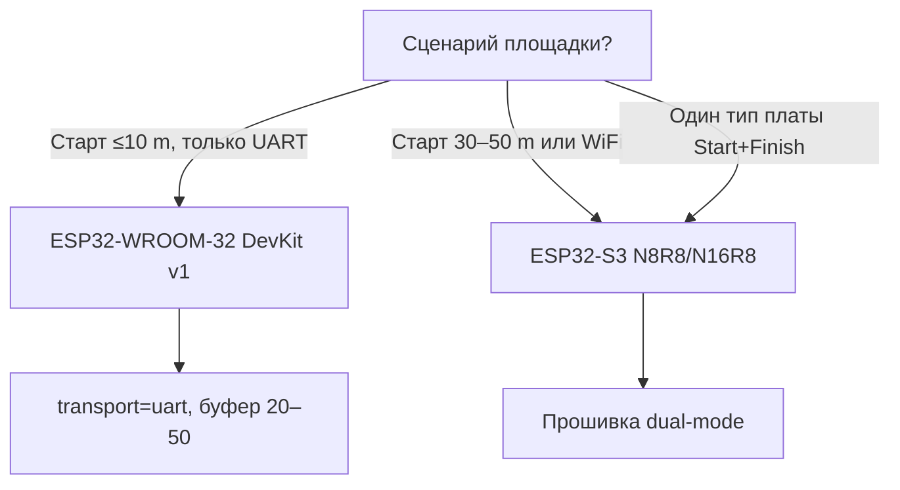

# Start Unit — стартовый модуль

Описание аппаратного и программного модуля **Start Unit** для системы хронометража скоростных роликов.

**Связанный документ:** [TZ.md](TZ.md) — общее ТЗ системы. **Функциональное описание:** [functional.md](functional.md)

**Версия:** 0.2  
**Дата:** 2026-05-28  
**Статус:** черновик

---

## 1. Назначение

Start Unit — автonomный блок на **ESP32** (в ТЗ рекомендуется **ESP32-S3**, см. [§4.1](#41-рекомендуемый-модуль-esp32-s3) и [§4.1.2](#412-esp32-s3-обязателен-нет-альтернативы)), который:

- даёт **световой и звуковой** сигнал старта (отсчёт 3–2–1–GO);
- фиксирует **момент старта** (`t_start`) с меткой времени;
- поддерживает **масс-старт** и **старт по одному**;
- принимает команды от **Pi 5** и дублирует их **физическими кнопками**;
- работает по **UART** (приоритет) или **WiFi** (fallback); RS485 — в v2.

Finish Unit описан в [TZ.md §3–4](TZ.md). Фото-финиш и камера — [camera.md](camera.md).

---

## 2. Место в системе

```
┌──────────────┐   UART / WiFi / RS485    ┌─────────────────┐
│  Start Unit  │ ────────────────────────►│  Raspberry Pi 5 │
│  ESP32-S3    │                          │  (Hub + Photo)  │
└──────────────┘                          └─────────────────┘
       ▲                                           ▲
       │ arm / go                                  │ web-UI
  [кнопки]                                  [смартфон / ПК]
```

| Роль | Взаимодействие |
|------|----------------|
| **Pi 5** | Конфиг heat, команды arm/go/cancel, приём события `START` |
| **Стартер** | Кнопки на модуле или экран «Start» на смартфоне |
| **Секретарь** | Формирует heat и режим (`mass` / `individual`) до активации |

---

## 3. Режимы старта

### 3.1. Масс-старт

- Один отсчёт **3–2–1–GO** для всего heat.
- Одно событие `START` на всех участников.
- `mode: "mass"`, поле `bib` отсутствует.

### 3.2. Старт по одному

- Индивидуальный отсчёт для каждого участника.
- Перед Arm на клиенте выбирается `bib`.
- Отдельное событие `START` с `bib` на каждого участника.
- `mode: "individual"`.

### 3.3. Последовательность (Arm → GO)

| Шаг | Действие | Состояние |
|-----|----------|-----------|
| 1 | Pi 5: `activate` heat | `idle` → `ready` |
| 2 | Arm (кнопка или API) | `ready` → `armed` |
| 3 | GO (кнопка или API) | `armed` → отсчёт → `GO` → `START` event |
| — | Cancel до GO | `armed` → `ready` |

Двухэтапный Arm защищает от случайного старта.

---

## 4. Железо

### 4.1. Рекомендуемый модуль ESP32-S3

| Параметр | Значение |
|----------|----------|
| Модуль | **ESP32-S3-WROOM-1-N16R8** (16 MB flash + 8 MB PSRAM) |
| Плата (MVP) | **ESP32-S3-DevKitC-1 v1.1** |
| Запас | dual-core, OTA, WiFi + UART одновременно, буфер событий |

Альтернатива в линейке S3: **N8R8**, если N16R8 недоступен на AliExpress.

Документация: [ESP32-S3-DevKitC-1 User Guide](https://documentation.espressif.com/esp-dev-kits/en/latest/esp32s3/esp32-s3-devkitc-1/user_guide_v1.1.html)

### 4.1.1. Почему в ТЗ указан именно S3

Выбор **не жёсткий**, а архитектурный — из [TZ.md](TZ.md) §2, §8.2:

| Причина | Пояснение |
|---------|-----------|
| **Единая платформа** с Finish Unit | Оба модуля — ESP32-S3, один стек прошивки (Arduino / ESP-IDF) |
| **Dual-mode Start** | UART **и** WiFi (старт до 50 m от Pi 5) — нужен стабильный WiFi-стек + UART параллельно |
| **Буфер ≥ 100 событий** | При обрыве связи (TR-08); PSRAM N16R8/N8R8 даёт запас |
| **Запас под OTA** | Обновление прошивки без USB на площадке (v2) |
| **GPIO** | Удобный DevKitC-1 под кнопки, MAX7219, зуммер; у Finish — 4× IR |

Для **спринта** (старт рядом с финишем, **только UART**) многие требования к S3 **избыточны** — см. уровень **MVP-UART** ниже.

### 4.1.2. ESP32-S3 обязателен? Нет — альтернативы

| Платформа | Start Unit | Finish Unit | Комментарий |
|-----------|------------|-------------|-------------|
| **ESP32-S3** (рекомендуется) | ✓ полный | ✓ | Как в ТЗ: WiFi + UART, буфер 100 |
| **ESP32-WROOM-32** (классика) | ✓ **MVP-UART** | ✓ возможно | Дешевле; WiFi + буфер 100 — только с **WROVER** / PSRAM |
| **ESP32-C3** | △ | △ | 1 ядро; не рекомендуется при WiFi + отсчёт + UART |
| **ESP8266** | ✗ | ✗ | Не подходит |
| **Arduino + ESP-01** | ✗ | ✗ | Вне архитектуры ТЗ |



| Если цель | Плата Start |
|-----------|-------------|
| **Минимум бюджета**, UART, кнопки, матрица | **ESP32-WROOM-32** (DevKit v1 / NodeMCU-32S) |
| Как в документации (WiFi fallback) | **ESP32-S3** DevKitC-1 |
| Одинаковые закупки с Finish | **ESP32-S3** на обоих |

**Ограничения ESP32 (классика) для Start:**

| Параметр | ESP32-WROOM-32 | ESP32-S3 |
|----------|----------------|----------|
| Цена платы (ориентир) | **400–900 ₽** | **1 200–2 500 ₽** |
| `micros()` / GO | ✓ | ✓ |
| UART + JSON | ✓ | ✓ |
| WiFi → AP Pi 5 | ✓ (тяжелее без PSRAM) | ✓ |
| Буфер 100 JSON offline | △ 4 MB flash, **буфер 20–50** | ✓ с PSRAM |
| Pinout в этом документе | **другой** — нужна своя таблица GPIO | §4.4 |

### 4.1.3. Уровни комплектации

| Уровень | MCU | Транспорт | Буфер offline | BOM MCU |
|---------|-----|-----------|---------------|---------|
| **MVP-UART** | ESP32-WROOM-32 | только UART | 20–50 событий | DevKit v1 |
| **Стандарт** (ТЗ) | ESP32-S3 N8R8/N16R8 | UART + WiFi | ≥ 100 | DevKitC-1 v1.1 |

Критерии приёмки §10 для **MVP-UART**: WiFi-пункты не обязательны; UART 10 m и кнопки — да.

### 4.2. BOM Start Unit

#### Стандарт (ESP32-S3, как в ТЗ)

| Позиция | Qty | Комментарий |
|---------|-----|-------------|
| ESP32-S3-DevKitC-1 (N16R8 / N8R8) | 1 | WiFi + UART |
| LED-матрица 8×8 (MAX7219) или 4× 7-segment | 1 | Отсчёт 3-2-1-GO |
| Зуммер 5 V (активный) | 1 | Стартовый сигнал |
| Кнопки тактовые | 2 | **Arm**, **Start** (GO) |
| Корпус IP65 | 1 | Outdoor |
| БП 5 V 1 A или powerbank | 1 | USB-C / micro-USB (только питание в поле) |
| Кабель UART к Pi 5 | 1 | 5–10 m, витая пара / мультикор (режим `uart`) |

**Ориентир стоимости:** 1 200 – 2 500 ₽ (без кабеля и корпуса).

#### MVP-UART (ESP32 классика, упрощённо)

| Позиция | Qty | Комментарий |
|---------|-----|-------------|
| ESP32 DevKit v1 / NodeMCU-32S (WROOM-32) | 1 | Только UART, без WiFi в прошивке |
| LED-матрица 8×8 (MAX7219) или 4× 7-segment | 1 | Те же |
| Зуммер 5 V | 1 | — |
| Кнопки Arm / Start | 2 | — |
| Корпус IP65, БП 5 V, кабель UART | 1 | — |

**Ориентир стоимости MCU:** 400 – 900 ₽. Pinout **не** совпадает с §4.4 — назначить GPIO при разводке (избегать strapping pins 0, 2, 12, 15 на ESP32).

### 4.3. Разъёмы USB на DevKitC-1 (только для разработки)

| Разъём | Назначение |
|--------|------------|
| **Micro-USB / UART** | Прошивка, `Serial.println`, отладка |
| **USB-C / Native** | JTAG, native USB ESP32-S3 |

На соревновании к ПК **не подключается** — только **5 V** и UART/WiFi к Pi 5.

### 4.4. GPIO (черновой pinout, MVP)

| Функция | GPIO (DevKitC-1) | Направление |
|---------|------------------|-------------|
| UART TX → Pi 5 | 43 (U0TXD) | out |
| UART RX ← Pi 5 | 44 (U0RXD) | in |
| Кнопка Arm | 0 | in, pull-up |
| Кнопка Start | 35 | in, pull-up |
| Зуммер | 38 | out (PWM) |
| LED matrix CLK (MAX7219) | 36 | out |
| LED matrix DIN | 37 | out |
| LED matrix CS | 42 | out |
| Status LED | 48 (RGB, опционально) | out |

Точный pinout — в следующей версии документа; при финальной разводке проверить strapping pins ESP32-S3.

---

## 5. Связь с Pi 5

Подробнее о выборе транспорта: [TZ.md §3.1](TZ.md#31-связь-pi-5--esp32-провод--wifi).

| Режим | Когда | Длина | Интерфейс |
|-------|-------|-------|-----------|
| **UART** | Старт рядом с финишем | ≤ 10 m | USB-UART #2 на Pi 5 |
| **WiFi** | Старт далеко, без кабеля | ≤ 50 m | ESP32 → WiFi AP Pi 5 |
| **RS485** | v2, длинная трасса | 50–300 m | MAX485 + витая пара |

**Dual-mode:** прошивка поддерживает `transport: uart | wifi`; переключение в web-UI Pi 5 или джumper.

При обрыве связи — **буфер ≥ 100 событий** на ESP32, replay после reconnect.

### Схема (UART, MVP)

```
Pi 5  USB-UART #2          Start ESP32
  TX ─────────────────────► RX (GPIO44)
  RX ◄───────────────────── TX (GPIO43)
 GND ─────────────────────── GND
```

---

## 6. Протокол

### 6.1. Событие START (ESP32 → Pi 5)

```json
{
  "type": "START",
  "ts_us": 1234567890123,
  "heat_id": "H001",
  "mode": "mass",
  "bib": 42,
  "src": "start_unit",
  "payload": {}
}
```

Поле `bib` — только для `mode: "individual"`.

### 6.2. Команды Pi 5 → Start Unit

| Команда | Описание |
|---------|----------|
| `config` | heat_id, mode, transport, countdown_sec |
| `arm` | Перевод в состояние armed |
| `go` | Запуск отсчёта |
| `cancel` | Отмена до GO |
| `sync` | Калибровка offset времени (1 Hz по UART) |
| `ping` | Проверка связи (WiFi) |

Формат: JSON-lines @ 115200 (UART) или HTTP POST / MQTT (WiFi).

### 6.3. Ответ на команду

```json
{"ok": true, "state": "ready|armed|countdown|running"}
```

---

## 7. Индикация и звук

| Фаза | LED-матрица | Зуммер |
|------|-------------|--------|
| Ready | «READY» / heat_id | — |
| Armed | «ARM» | короткий pip |
| 3-2-1 | Цифры обратного отсчёта | pip на каждую цифру |
| GO | «GO» / зелёный | длинный сигнал |
| Cancel | «---» | два коротких |

Длительность интервала отсчёта: **1 с** (настраивается в web-UI Pi 5, по умолчанию).

---

## 8. Прошивка

| Компонент | Стек |
|-----------|------|
| Framework | Arduino или ESP-IDF |
| UART | JSON-lines, ring buffer событий |
| WiFi | HTTP client или MQTT → Pi 5 |
| Timing | `esp_timer_get_time()` / `micros()` при GO |
| OTA | через Pi 5 или USB (v2) |

### Состояния (FSM)

```
idle → ready → armed → countdown → fired → ready
                  ↘ cancel ↗
```

### MVP v1

- [ ] UART ↔ Pi 5: config, arm, go, cancel, START event
- [ ] WiFi ↔ Pi 5: те же команды
- [ ] Кнопки Arm / Start
- [ ] LED-матрица 3-2-1-GO + зуммер
- [ ] Буфер 100 событий при offline
- [ ] mass + individual

---

## 9. Монтаж и эксплуатация

| Параметр | Рекомендация |
|----------|--------------|
| Расположение | Стартовая линия, видно участникам и стартеру |
| Высота дисплея | 1–1.5 m от земли |
| Питание | Powerbank 5 V в корпусе IP65 |
| Кабель UART | В защитном канале / под лентой, не на проезжей части |
| WiFi | Антенна ESP32 не закрыта металлом корпуса |

---

## 10. Критерии приёмки

- [ ] Масс-старт: 10 заездов подряд без пропуска `START`
- [ ] Individual: 10 участников подряд, корректный `bib`
- [ ] Arm → Cancel → Arm → GO работает без перезагрузки
- [ ] UART: стабильная работа при кабеле 10 m
- [ ] WiFi: работа при расстоянии ≥ 30 m до Pi 5
- [ ] При обрыве связи 30 с — события в буфере, replay после reconnect
- [ ] Кнопки и web-UI синхронизированы через Pi 5

---

## 11. История версий

| Версия | Изменения |
|--------|-----------|
| 0.1 | Первый черновик Start Unit |
| 0.2 | §4.1: ESP32-S3 не обязателен; сравнение с ESP32-классикой; BOM MVP-UART vs стандарт |
